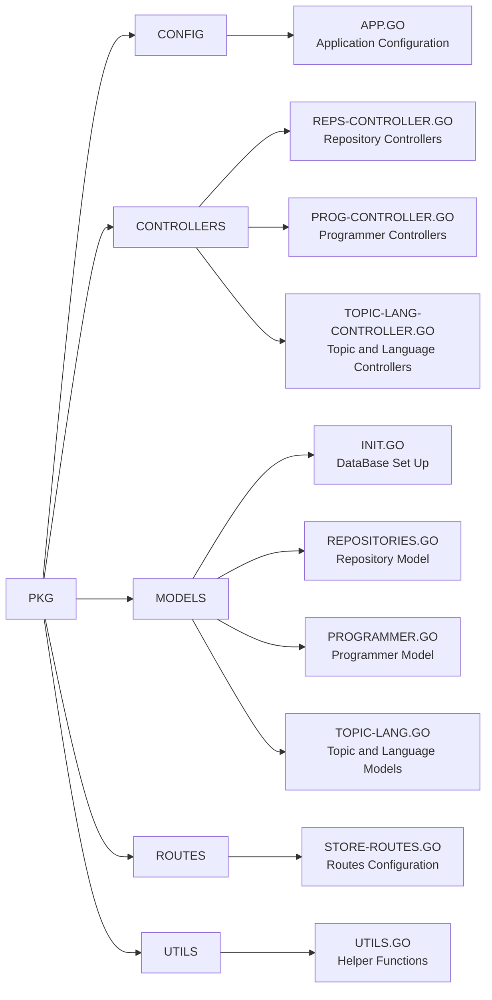
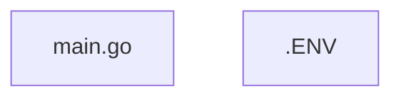
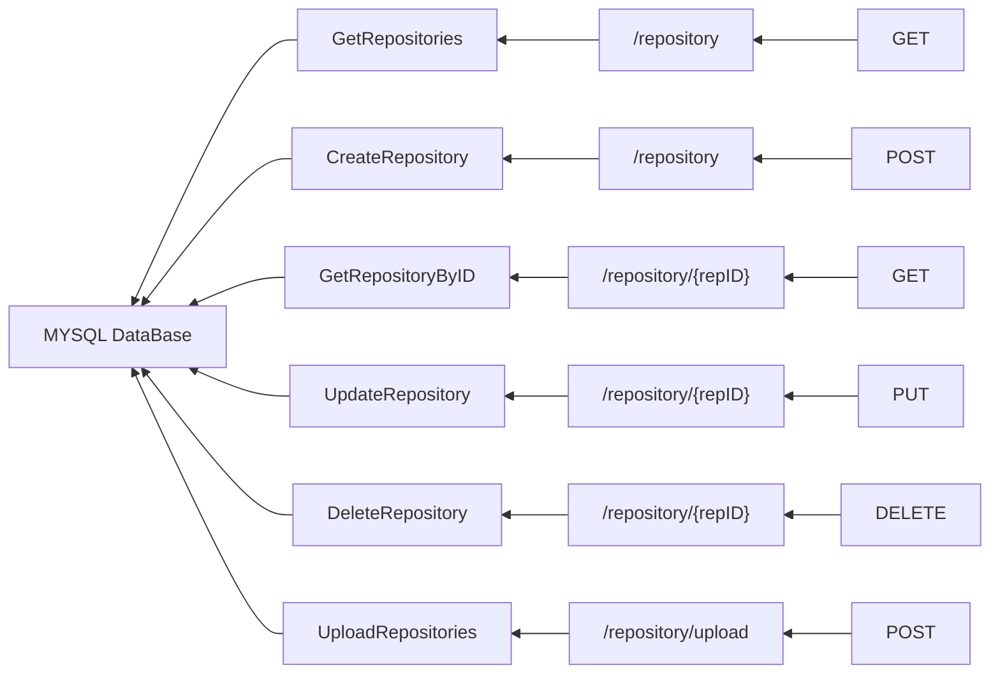
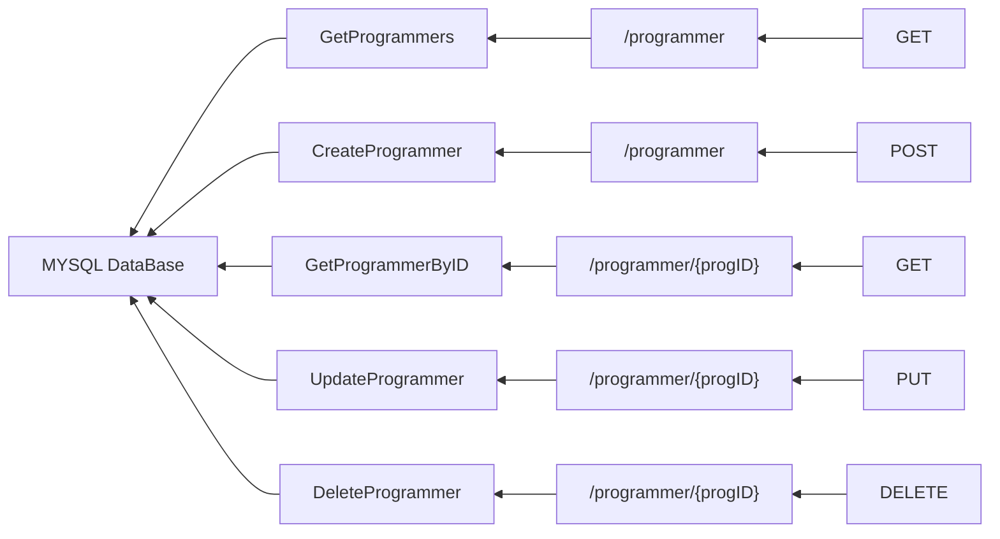
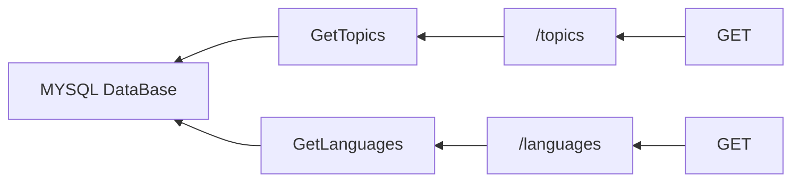

# REPOSITORY STORE

## STRUCTURE

```mermaid
graph LR;
    pkg["PKG"]-->config["CONFIG"];
    pkg["PKG"]-->controllers["CONTROLLERS"];
    pkg["PKG"]-->models["MODELS"];
    pkg["PKG"]-->routes["ROUTES"];
    pkg["PKG"]-->utils["UTILS"];

    config-->app["APP.GO<br>Application Configuration"]
    routes-->store-routes["STORE-ROUTES.GO<br>Routes Configuration"]
    utils-->utils-go["UTILS.GO<br>Helper Functions"]

    models-->init["INIT.GO<br>DataBase Set Up"]
    models-->repositories["REPOSITORIES.GO<br>Repository Model"]
    models-->programmer["PROGRAMMER.GO<br>Programmer Model"]
    models-->topic_lang["TOPIC-LANG.GO<br>Topic and Language Models"]

    controllers-->reps-controller["REPS-CONTROLLER.GO<br>Repository Controllers"]
    controllers-->prog-controller["PROG-CONTROLLER.GO<br>Programmer Controllers"]
    controllers-->topic-lang-controller["TOPIC-LANG-CONTROLLER.GO<br>Topic and Language Controllers"]
```

```mermaid
graph TD;
    main["main.go"];
    env[".ENV"]
```

## ROUTES
### Repository

```mermaid
graph RL;
    database["MYSQL DataBase"]

    get["GET"]-->repository["/repository"]
    repository-->getrepository["GetRepositories"]
    getrepository-->database

    post["POST"]-->repository-1["/repository"]
    repository-1-->createrepository["CreateRepository"]
    createrepository-->database

    get-1["GET"]-->repository-2["/repository/{repID}"]
    repository-2-->getrepositorybyid["GetRepositoryByID"]
    getrepositorybyid-->database

    put["PUT"]-->repository-3["/repository/{repID}"]
    repository-3-->updaterepository["UpdateRepository"]
    updaterepository-->database

    delete["DELETE"]-->repository-4["/repository/{repID}"]
    repository-4-->deleterepository["DeleteRepository"]
    deleterepository-->database

    post-1["POST"]-->repository-5["/repository/upload"]
    repository-5-->uploadrepository["UploadRepositories"]
    uploadrepository-->database
```
### Programmer

```mermaid
graph RL;
    database["MYSQL DataBase"]

    get["GET"]-->programmer["/programmer"]
    programmer-->getprogrammer["GetProgrammers"]
    getprogrammer-->database

    post["POST"]-->programmer-1["/programmer"]
    programmer-1-->createprogrammer["CreateProgrammer"]
    createprogrammer-->database

    get-1["GET"]-->programmer-2["/programmer/{progID}"]
    programmer-2-->getprogrammerbyid["GetProgrammerByID"]
    getprogrammerbyid-->database

    put["PUT"]-->programmer-3["/programmer/{progID}"]
    programmer-3-->updateprogrammer["UpdateProgrammer"]
    updateprogrammer-->database

    delete["DELETE"]-->programmer-4["/programmer/{progID}"]
    programmer-4-->deleteprogrammer["DeleteProgrammer"]
    deleteprogrammer-->database
```

### Topic and Language

```mermaid
graph RL;
    database["MYSQL DataBase"]

    get["GET"]-->topic["/topics"]
    topic-->gettopic["GetTopics"]
    gettopic-->database

    get-1["GET"]-->lang["/languages"]
    lang-->getlang["GetLanguages"]
    getlang-->database
```